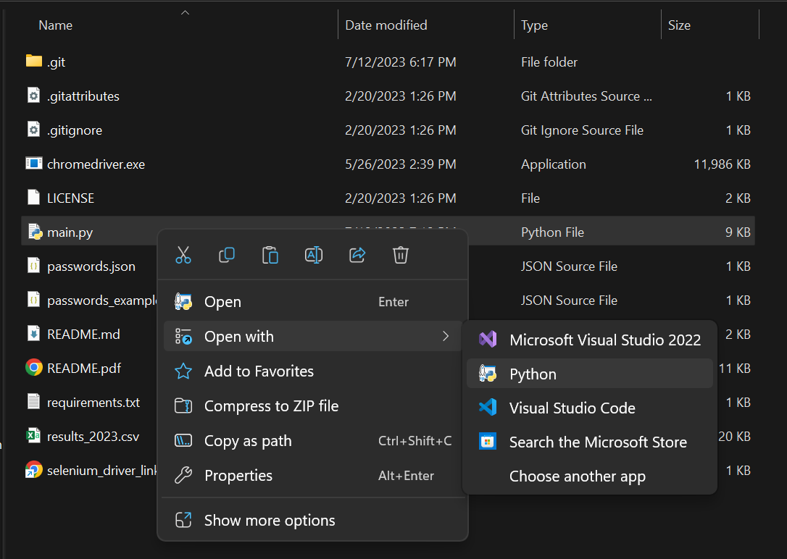

# pyAMZN
This will obtain a list of all your Amazon purchases (within a given year) and save it as a csv.

# links
[Buy Me ☕](https://www.buymeacoffee.com/jgarza97885)   
[youtube ▶](https://youtu.be/1BCBll0lsiM)  
~~[youtube tutorial for noobs ▶️]()~~
> note: tell noobs to `git gud`

# requirements
* python 3.0 or later
  * for help google "How to install Python"
  * or use ChatGPT or Bard
* chrome
* [selenium chrome driver](https://chromedriver.chromium.org/downloads) 
  * that matches the version of chrome
  * note: their is already one in the root directory, but it might not match your chrome version.
* an amazon account

# setup & run
1. get/install the requirements listed above.
2. run `pip install -r requirements.txt`
    * this will install some python libs
3. edit the `passwords_example.json` with your email and password.
4. rename `passwords_example.json` to `passwords.json`
5. run main.py (i.e. `py main.py` , or `python main.py`)
    * you can also right click the main.py file, and open with Python.
    * 
6. pass captcha (if needed)
    * you might need to pass the captcha manually and then resume the code.
7. the program will take a while, but when it's done it will save a .csv file within the root directory.

# FAQs
## captcha
if captch blocks during login the program will wait, and you'll have to pass captcha manually.   
Once you pass captcha, go to the program in the terminal and hit enter.  
the program will resume.  

## selenium chrome driver
this allows your code to work with chrome, and therefore the version numbers should match.
please make sure the chromedriver.exe is in the root directory.

# todo  
[] add logging support
[] make a UI (low priority)